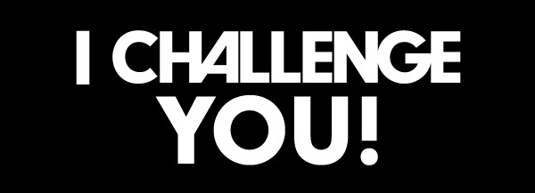

# IT-WG-Recrutment-tasks

Mai jos sunt descrise doua task-uri. Eu le-as numi "Let's do something for fun!". Astfel, sunt prezente pozitiile: developer si designer.

Va urez succes si astept solutiile pe mail-ul: `lucavictor220@gmail.com`. Just have fun with it!

**IMPORTANT:** Adaugati Tagul `[ITC][Recrutari]`

REALIZATI UN SINGUR TASK PENTRU POZITIA CE O VRETI SA O OCUPATI!!!

DL: 30/10/2016

### Designer task

Imaginativa ca ati ajuns sa faceti internship la Google! Aceasta in scurt timp vrea sa lanseze un nou proiect care este o platforma de muzica precum este SoundCloud de exemplu.
Prima ce o sa vada user-ul este "Landing page". Creati o astfel de pagina folosind instrumentele preferate.(ex: PS, AI, Sketch). Ar fi ciotka sa aploadati aici: <https://www.behance.net/>

### Programming

Scrieti un script in limbajul vostru de preferinta care ar aprecia cit sunt de asemanatoare doua fisiere. Aveti de facut 3 lucruri:
- Cititi continutul fisierelor.
- Analizati continutul dupa cuvinte a fiecarui fisier. (La discretia voastra cit de complexa analiza).
- Comparati si afisati raspunsul sub forma de procentaj.

Puteti sa luati fisierele din aceasta repositorie: `file1.txt file2.txt`
